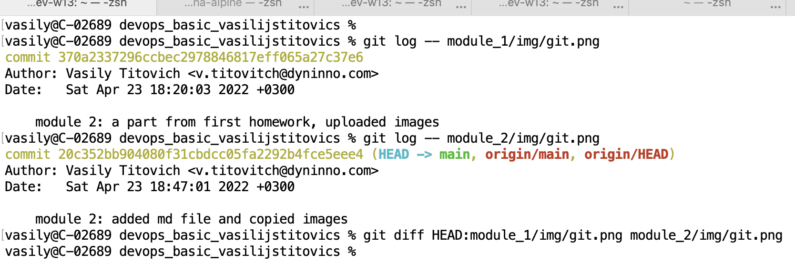
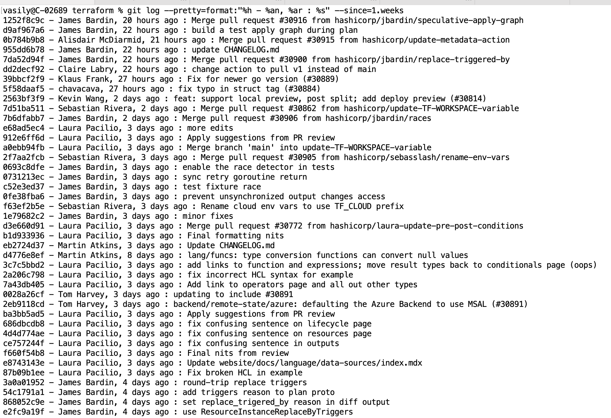
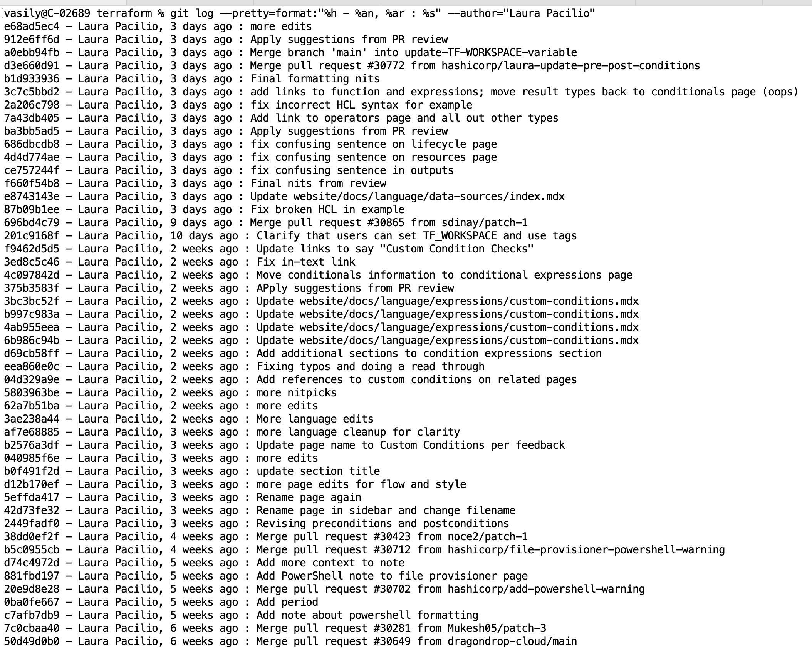
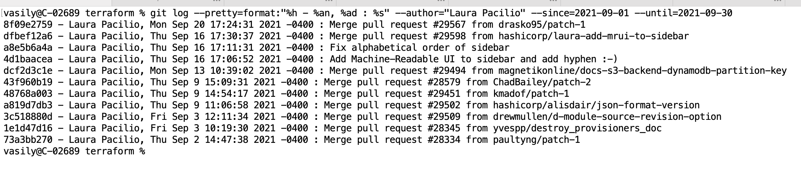
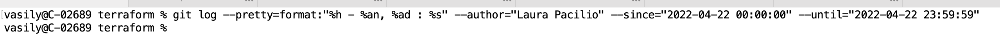

# DevOps Basic

### module 2

Git log shows different hash for same file, it is expected, as they are committed separately,
but the git diff command doesn't see difference between files.  

Changes made 1 week ago can be found with command `git log` with option `--since`,
as argument can be passed relative or absolute date.
`git log --since=1.weeks` or by `git log --since=2022-04-16`
In order to see results in more compact way, we are use `--pretty` option  
`git log --pretty=format:"%h - %an, %ar : %s" --since=1.weeks`

To find out commits made by a user can be used `--author` option  
`git log --pretty=format:"%h - %an, %ar : %s" --author="Laura Pacilio"`

To find out user commits in a specific date range we can apply options from above methods together  
`git log --pretty=format:"%h - %an, %ad : %s" --author="Laura Pacilio" --since=2021-09-01 --until=2021-09-30`

On 22 of April Laura doesn't made any commit  
`git log --pretty=format:"%h - %an, %ad : %s" --author="Laura Pacilio" --since="2022-04-22 00:00:00" --until="2022-04-22 23:59:59"`

