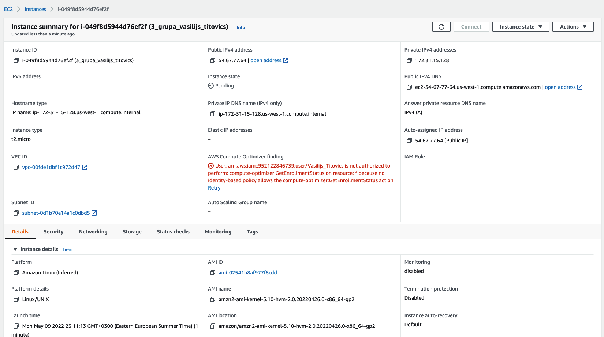

# DevOps Basic

### module 3

#### Instance screenshot

On **Details** tab is shown basic info about instance, such as instance type (platform), instance launch time, instance IDs,
location and so on.  

On **Security** tab is shown security group, owner id, inbound/outbound rules, it describes for example: from which ip 
addresses are allowed connection to instance.  

On **Networking** tab are shown public and private IPs, DNS name and so on. This tab contains info of network, which is
often used to arrange communication between different instances, and their connection between each other in AWS network.

#### Repository cloning to AWS instance using ssh key screenshot 

